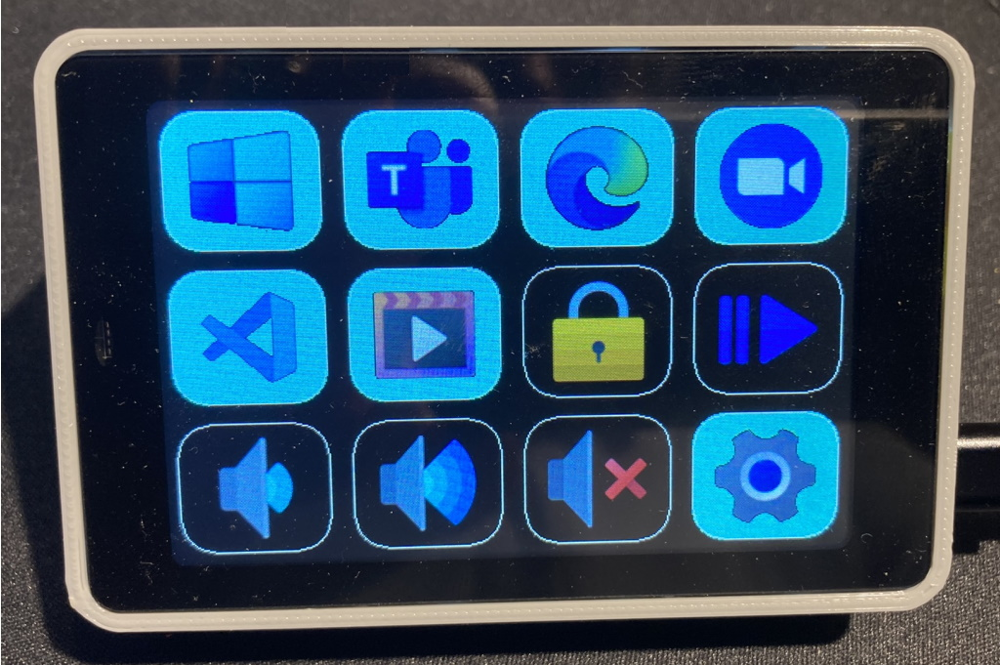

# FreeTouchDeckWT32
This is a port of Dustin Watt's FreeTouchDeck project (https://github.com/DustinWatts/FreeTouchDeck.git). It was initially only for the WT32-SC01 integrated ESP32, LCD, and capacitive touch screen board. http://www.wireless-tag.com/portfolio/wt32-sc01/, but now, just like the original FreeTouchDeck, it also supports other boards provided the appropriate pins and options are defined.

The main change is to allow more buttons per page  - the screen area is just a bit smaller than the size of twelve StreamDeck buttons which seems reasonable. The code is currently set to three rows of four buttons, but can be changed to three rows of five buttons (or two rows of four, etc.) by modifying FreeTouchDeckWT32.h: "#define BUTTON_ROWS 3" and "#define BUTTON_COLS 5".  In principle it should support larger arrays, but not tested, and the configurator page is set to a maximum of 3x5. 

The configurator displays an array of three rows of five buttons, with a drop down list to select the menu page to be modified. If you are using fewer than 3x5, simply ignore the extra rows and columns. On the to-do list is to generate the HTML dynamically to correspond with the number of rows and columns.

To aid the configurability to adapt to different mnenu layout, the code now has an array of  Menus (pages).  Each Menu has a 2D array of Buttons, each Button has an array of 3 Actions, etc.  The code ends up addressing a specific button with something like "menu[pageNum].button[row][row].islatched = true;" Rather than a dedicated home page and a dedicated return to home in the bottom right of each page each button on each page can be modified, and in principle any page could call any other. There is no protection to force a button that provides a way out of a menu, so make sure that you define one.

You can set different background colors for a button that performs an action (black background in the image above), or links to another menu (light blue in the image.) This is controlled on the Settings page of the configurator.

If you don't want to use all buttons use the configurator to set the logo to "blank.bmp" and make sure that there are no actions defined for that button. Any button with those characteristics will not be drawn.

Other changes: 
1. There are now 10 pages. This includes Menu0 (home). This can be expanded, but I am not sure where the limit is.
2. Updated to latest platformio Arduino platform (2.x) There has been a report that it doesn't work with 2.0.2, but it does work with 2.0.3.
3. Changed from SPIFFS to LittleFS. 

Build Notes:
1. You need to make sure that the appropriate pins are defined for your hardware configuration. I have built it for the WT32-SC01 and for a handwired ESP32 module + resistive touchscreen. Pin definitions for these two configurations are in "platformio.ini_examples.txt. Cut and paste one set of definitions into platformio.ini. This should always work for the WT32-SC01 as the pins are set by the wiring on the PCB. If you build a unit yourself you will have to make sure that your wiring and the  platformio.ini definitions are consistent

2. Why are the pins defined in platformio.ini rather than in a header file in the code? The TFT_eSPI library is normally configured by modifying a library file, but that means that if the library is updated you lose your configuration. Putting them in platformio.ini gets around that. 
   
3. If you use a capacitive touch screen you may see messages like
        
        In file included from include/FreeTouchDeckWT32.h:14,
                 from include/SaveConfig.h:3,
                 from src/SaveConfig.cpp:1:
        .pio/libdeps/esp-wrover-kit/TFT_eSPI/TFT_eSPI.h:909:8: warning: #warning >>>>------>> TOUCH_CS pin not defined, TFT_eSPI touch functions will not be available! [-Wcpp]
        #warning >>>>------>> TOUCH_CS pin not defined, TFT_eSPI touch functions will not be available!`
    
    You can get rid of these by defining TOUCH_CS in platformio.ini to any unused pin that is a valid output pin. The alternative is to not define TOUCH_CS (delete the line, or put a semi-colon in front of it) and just ignore the messages.

        #define TOUCH_CS=33

4. The system tries to display the logo in "freetouchdeck_logo.bmp" at startup. If you don't want anything displayed make sure that the file doesn't exist. In this case you will see a message like the following on the serial port. As long as you didn't weant anything displayed at startup ignore the message.
        
        [  1159][E][vfs_api.cpp:104] open(): /littlefs/logos/freetouchdeck_logo.bmp does not exist, no permits for creation

5. You may  see some error messages like 
   
        [vfs_api.cpp:104] open(): /littlefs/list does not exist 
        
   This is a known issue with ESPAsyncWebsServer related to LittleFS supporting folders while SPIFFS does not. See https://github.com/lorol/

6. Having trouble? There are some debug messages that can be enabled in FreeTouchDeck.h
   
        #define LOG_MSG_BASIC 1
        #define LOG_MSG_LEVEL 1  // 1=ERROR, 2=ERROR+WARN, 3=ERROR+WARN+INFO
        #define LOG_MSG_DEBUG 0
        #define LOG_MSG_TOUCH_DEBUG 0  // messages to console each time a touch is detected

   Try setting LOG_MSG_LEVEL to 3 and you will get quite a few more status messages

